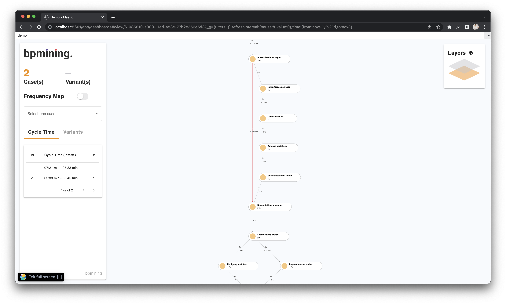

# bpmining Kibana Plugin <!-- omit in toc -->

Kibana Plugin to analyse your business processes.

- [✨ Features](#-features)
- [🚀 Getting Started](#-getting-started)
  - [🏗 Install the Kibana Plugin](#-install-the-kibana-plugin)
  - [📀 Start Elasticsearch](#-start-elasticsearch)
  - [🪧 Add the sample data](#-add-the-sample-data)
- [🔨 Development](#-development)
    - [🤖 Setup](#-setup)
    - [📝 Scripts](#-scripts)

## ✨ Features

Process Mining via a Kibana Plugin.  

bpmining allows you to visualize your mined process data through multiple layers. 




## 🚀 Getting Started

Download a specific [release](https://github.com/bpmining/bpmining-kibana-plugin/releases) or start directly via [development](#-development).

### 🏗 Install the Kibana Plugin

Download [Kibana 8.2.1](https://www.elastic.co/de/downloads/past-releases/kibana-8-2-1) (currently we support only this specific version).

Navigate into the unzipped Kibana directory `cd kibana-8.2.1`.

To [install the plugin](https://www.elastic.co/guide/en/kibana/current/kibana-plugins.html) you have to execute one the following command:

```bash
$ bin/kibana-plugin install <package name or URL>
```
You can install a plugin from a local file:
```bash
$ bin/kibana-plugin install file:///local/path/to/custom_plugin.zip
```
or from an online source, directly from our releases:
```bash
$ bin/kibana-plugin install https://github.com/bpmining/bpmining-kibana-plugin/releases/download/v1.1.1/bpmining-8.2.1.zip
```

### 📀 Start Elasticsearch

For development and testing you could use the following options to start a docker container without any security:

```bash
docker run --name es01 -p 9200:9200 -e xpack.security.enabled=false -e discovery.type=single-node -e ES_JAVA_OPTS='-Xms750m -Xmx750m' -it docker.elastic.co/elasticsearch/elasticsearch:8.2.1
```

### 🪧 Add the sample data

Start up Kibana (`bin/kibana`).

Add the sample data we provide via the Kibana UI:

Navigate to Add data > Upload file to upload your the `sample_data/sample-data-diff-proc.json` file.

You are ready to go! Create a Visualization and use it on your dashboards 📈

## 🔨 Development

#### 🤖 Setup

Before start developing you must setup your [Kibana development environment](https://github.com/elastic/kibana/blob/8.2/CONTRIBUTING.md#development-environment-setup).  
Clone the [Kibana repository](https://github.com/elastic/kibana/) and work through [this getting started guide](https://www.elastic.co/guide/en/kibana/master/development-getting-started.html)
If you can successfully run yarn kbn bootstrap then you are ready and can continue 🎉.

To develop the plugin locally you must mount it into the `/plugin` directory of the kibana repository. You can do so by **cloning** it into the directory **or** mounting it as **subtree**.

Adding the plugin as [git subtrees](https://www.atlassian.com/git/tutorials/git-subtree) could be done by:

```bash
# Adding the remote
git remote add bpmining git@github.com:bpmining/bpmining-kibana-plugin.git

# Adding the repo as subtree ar /plugins/bpmining
git subtree add --prefix plugins/bpmining --squash bpmining <branch>

# To push back
git subtree push --prefix plugins/bpmining bpmining <branch>
```
You also have to start your [elasticsearch](https://www.elastic.co/guide/en/elasticsearch/reference/current/starting-elasticsearch.html) instance. The easiest way is to run an elasticsearch docker container and define a data volume to have persistent data. 
The version of elasticsearch must match the kibana version.

To login to kibana & elasticsearch you can use one of the [built-in users](https://www.elastic.co/guide/en/elasticsearch/reference/current/built-in-users.html).

#### 📝 Scripts

<dl>
  <dt><code>yarn kbn bootstrap</code></dt>
  <dd>Execute this to install node_modules and setup the dependencies in your plugin and in Kibana</dd>

  <dt><code>yarn run build</code></dt>
  <dd>Execute this to create a distributable version of this plugin that can be installed in Kibana</dd>
  
  <dt><code>yarn start</code></dt>
  <dd>Execute this to start the application.</dd>
</dl>
